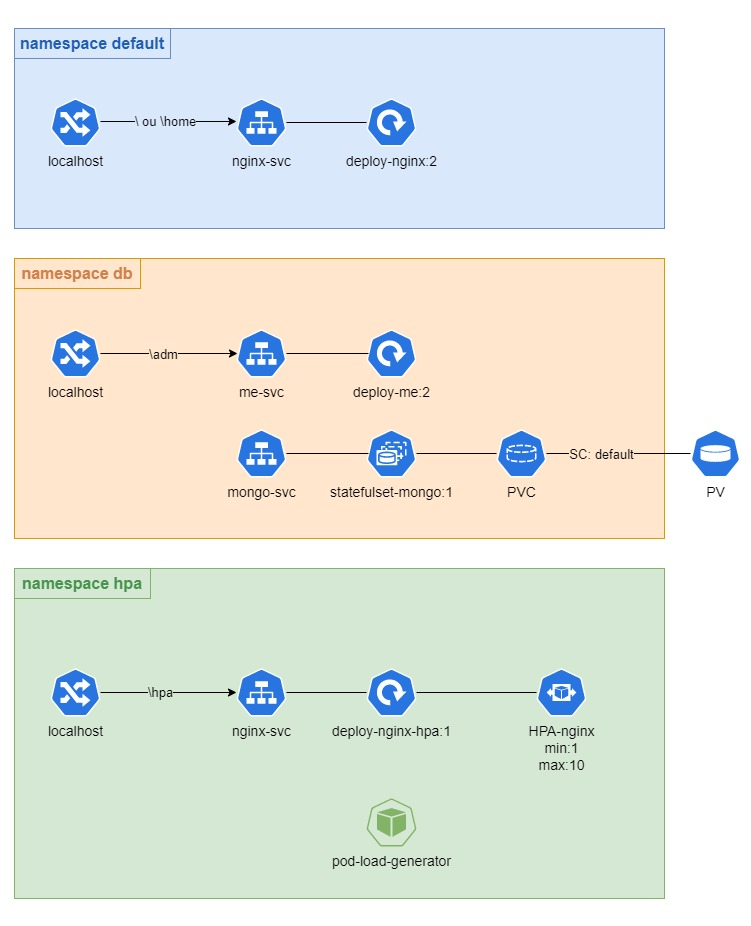

# Projeto prático Kubernetes
O atual projeto busca implementar um sistema exemplo completo com Kubernetes, adotando boas práticas durante a implementação.

## Conceitos abordados
Implementação prática de:
- Ingress,
- Deployments,
- Statefulset,
- Pods,
- Namespace,
- Services,
- PV,
- PVC,
- SC,
- Horizontal Pod Autoscaler - HPA

## Imagens utilizadas
Criação de ambientes com as seguintes imagens:
- Nginx
- Mongo
- Mongo Express
- Imagem elaborada pelo autor baseada em Nginx - 1
- Imagem elaborada pelo autor baseada em Nginx - 2

## Ilustração da estrutura física do projeto



## Subindo sistema em cluster local
Para criação desse sistema, o cluster local utilizado foi o Kind. Os seguintes passos foram tomados:

1. Criar cluster com as configurações do arquivo cluster-config.yaml
```kind create cluster --config=cluster-config.yaml```

2. Criar e instalar as imagens Docker, instalar o NGINX Ingress Controller e o Metrics Server no cluster via o arquivo requirements/configs.sh
```./configs.sh```

3. Criar os componentes da pasta default

4. Criar os componentes da pasta db

5. Criar os componentes da pasta hpa

6. Acessar *localhost* no navegador